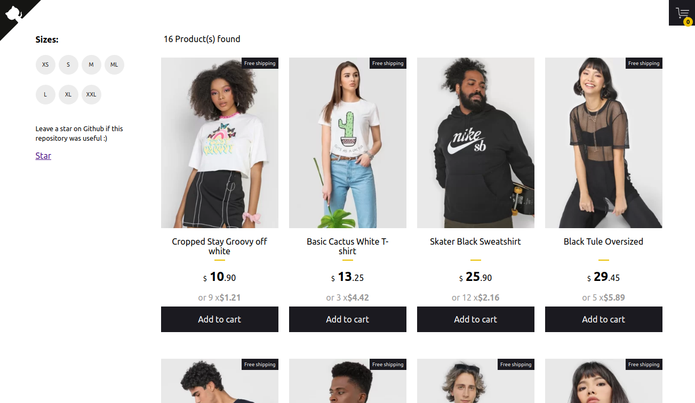

## 🛍️ Simple ecommerce cart application

<p align="center">

  
</p>

## Basic Overview - 
<p align="left">

  
</p>


This simple shopping cart prototype shows how React with Typescript, React hooks, react Context and Styled Components can be used to build a friendly user experience with instant visual updates and scaleable code in ecommerce applications.

#### Features

- Add and remove products from the floating cart using Context Api
- Filter products by available sizes using Context Api
- Responsive design

<!--
## Getting started

Try playing with the code on CodeSandbox :)

[](https://codesandbox.io/s/74rykw70qq)
 -->

## Build/Run

#### Requirements

- Node.js
- NPM

```javascript

/* First, Install the needed packages */
npm install

/* Then start the React app */
npm start

/* To run the tests */
npm run test

```


<br/>
<br/>

<p align="center"></p>
<p align="center">
<sub>A little project by <a href="http://github.com/SagarSingh1510/">Sagar Singh</a></sub>
</p>
# Shopping
